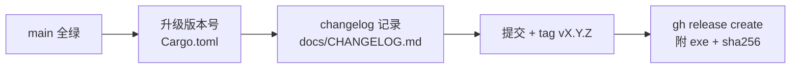

# 部署/发布手册（.rules/deploy.md）

## 1. 发布物

| 物 | 来源 |
|----|------|
| `wingetui.exe` | `cargo build --release`（Windows） |
| GitHub Release | `gh release create` 附带 exe 与 SHA256 |

## 2. 发布流程

## 3. 版本策略

- MVP 阶段：`0.1.x`，仅升 patch
- 行为破坏性变更：升 minor
- 不做 nightly/dev 渠道

## 4. 安装方式（用户侧）

- `winget install --id=wingetui.wingetui`（若未来提交 winget 社区仓库）
- 或直接下载 release exe 放入 PATH

> 注：MVP 阶段仅提供 exe 直下；winget 社区仓库提交流程后续再议。
