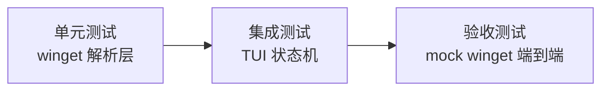

# 测试规范（.rules/testing.md）

## 1. 测试层级

| 层级 | 对象 | 要求 |
|------|------|------|
| 单元测试 | `crates/winget` 输出解析、命令构造 | 覆盖 JSON 正常/畸形/字段缺失/退出码非零 |
| 集成测试 | TUI 状态机、事件处理 | 模拟按键事件驱动，断言状态迁移 |
| 验收测试 | mock winget 二进制 + 全流程 | CI 上跑通搜索→升级→安装→卸载主路径 |

## 2. 测试数据（fixture）

- winget JSON 样例放在 `crates/winget/tests/fixtures/`，**必须脱敏**（公开仓库，禁含本机真实软件列表/账号信息）
- mock winget 二进制：`tests/mock-winget/`（Rust 或脚本实现，按 `--output json` 返回固定 fixture）

## 3. 命令约定

- 全量测试：`cargo test`（Windows CI runner）
- 针对性单测：`cargo test -p winget` 或按模块过滤
- 测试输出落盘判定（Windows 坑）：`cargo test > log 2>&1; echo "EXIT=$?" >> log`，以日志为准

## 4. 覆盖率要求（MVP）

- 解析层核心函数：分支全覆盖（正常/畸形/空）
- 状态机：每个合法按键事件至少一个测试
