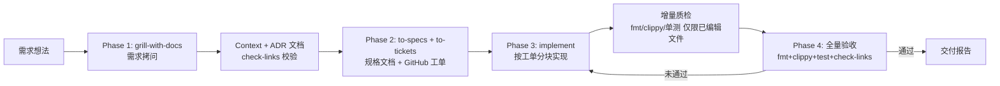
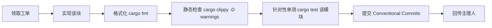
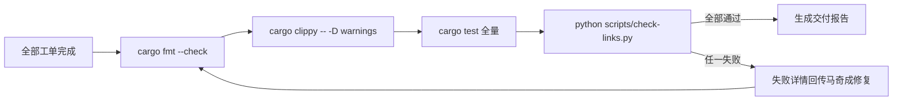

# 工作流规范（.rules/workflows.md）

wingetui 的开发工作流。所有阶段流程遵循 mermaid 定义，改流程先改图再改文。

## 1. 完整交付 SOP

## 2. 实现块质检流程（Phase 3 内部）

## 3. 全量验收流程（Phase 4）

## 4. 角色分工

| 角色 | 成员 | 职责 |
|------|------|------|
| 主理人 | 闻道明 | Phase 1 拷问、Context/ADR、验收编排、交付报告 |
| 规格工程师 | 章定规 | Phase 2 to-specs / to-tickets |
| 实现工程师 | 马奇成 | Phase 3 按工单实现 |

## 5. 分支与合入

- 功能开发在 `feat/<工单号>` 分支，经 PR 合入 `main`
- PR 必须 CI 全绿（fmt + clippy + test + check-links）
- 禁止直接 push 到 `main`
