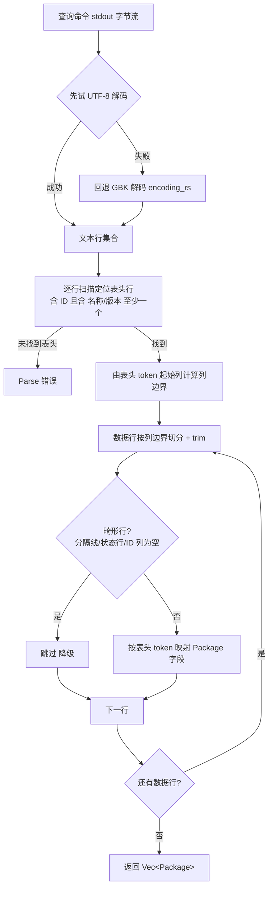
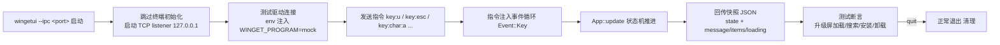

# Bugfix 规格 — 查询类命令 `--output json` 不支持（文本表格解析 + GBK + IPC e2e）

> 规格工程师：章定规 · 2026-08-14 · 状态：已定稿
> 上游输入：主理人闻道明根因诊断（2026-08-14 23:30 本机实测）；本规格修正 [MVP 规格](mvp.md) §4.3 的查询参数契约，是 Phase 3 修复的唯一依据；工单映射见 [§8](#8-工单映射)。

## 1. 背景

MVP 已在真实环境交付，但 **winget 本机 v1.29.280 的查询类子命令不支持 `--output json`**，导致三个查询屏（搜索 / 可升级 / 卸载列表）在真实 winget 下全部失败。用户先撞到升级屏：`加载失败: 命令执行失败 (code=-1978335230)`。

### 根因（本机实测，2026-08-14）

- `winget search powershell --output json` → 退出码 `-1978335230`（u32 = `0x8A150002`），stdout 输出本地化错误 `当前命令无法识别参数名称: "--output"`，**stderr 为空**。
- 代码 `crates/winget/src/commands.rs` 的 `QUERY_FLAGS` 含 `--output json`，被拼进 `search_args` / `list_upgradeable_args` / `list_installed_args` → 三个查询屏全部失败。
- **mock winget 返回 JSON，掩盖了问题**：CI 全绿，真实环境全挂。
- 连带发现两条真实 winget 行为：
  1. **编码**：中文环境输出为 **GBK**（非 UTF-8）。`--output json` 失败时的 usage 文本也是 GBK。
  2. **文本输出为对齐表格**：表头列 `名称 ID 版本 匹配(或 可用) 源`，列间以空白对齐，列宽随内容变化（实测 `winget search` 表头为 `名称 ID 版本 匹配 源`；`winget upgrade`/`winget list` 第 4 列为 `可用`）。数据行内容可能含空格（如 `Tag: powershell`）。

## 2. 目标 / 非目标

### 目标
1. 三个查询屏在真实 winget v1.29.280 下可加载：搜索、查看可升级、卸载列表。
2. 查询类命令去掉 `--output json`，解析 winget 文本表格输出。
3. 输出字节流先试 UTF-8 再回退 GBK 解码（`encoding_rs`），中文环境不乱码。
4. 补齐端到端集成测试基础设施：`wingetui --ipc <port>` 测试钩子 + `tests/e2e/`，用真实 wingetui 二进制跑真实流程，杜绝"mock 掩盖真实缺陷"复发。

### 非目标
- 变更类命令（install / upgrade / uninstall）行为不变，不动其参数。
- 不新增包详情页、模糊匹配、批量多选等 MVP 非目标功能。
- 不引入 `--output json` 之外的新 winget 输出格式支持（不解析 `winget export` 等）。
- 不改 CI 平台（仍 `windows-latest`）。

## 3. 范围

交付物 = 2 个实现块，依赖关系如下：

```mermaid
flowchart LR
    F1[F1 fix(winget)<br/>文本表格解析 + GBK 解码<br/>mock/fixture 文本表格化]
    F2[F2 test(e2e)<br/>--ipc 测试钩子 + tests/e2e]
    F1 --> F2
```

- **F1** 无前置依赖（在 MVP 已合入基础上改 winget 层），先行。
- **F2** 依赖 F1：e2e 断言"升级屏加载/搜索/安装/卸载"依赖 F1 让 mock 输出文本表格并修正查询参数。

## 4. 接口契约

### 4.1 winget 命令契约修正（覆盖 mvp.md §4.3）

查询类命令**去掉 `--output json`**，保留非交互 flags：

| 类别 | 命令 | 附加参数（修复后） |
|------|------|--------------------|
| 查询 | `winget search --query <q>` | `--disable-interactivity --accept-source-agreements` |
| 查询 | `winget upgrade`（列可升级） | `--disable-interactivity --accept-source-agreements` |
| 查询 | `winget list`（列已安装） | `--disable-interactivity --accept-source-agreements` |
| 变更 | `winget upgrade --id <id>` / `--all` | 不变：`--silent --accept-package-agreements --accept-source-agreements --disable-interactivity` |
| 变更 | `winget install --id <id>` / `uninstall --id <id>` | 同上不变 |

- 参数一律经 `Command::arg()` 数组传入，**禁止 shell 拼接**（[安全规范](../.rules/security.md)）。
- `QUERY_FLAGS` 常量改为 `["--disable-interactivity", "--accept-source-agreements"]`；对应 argv 单测同步更新。

### 4.2 crates/winget 解析层接口（F1 修改）

```rust
// crates/winget/src/parser.rs（替换原 JSON 解析）
/// 解码查询命令 stdout 字节流：先试 UTF-8，失败回退 GBK（encoding_rs）。
/// winget 中文环境输出 GBK，英文环境输出 UTF-8，二者都须兼容。
pub fn decode_winget_output(bytes: &[u8]) -> String;

/// 从文本表格解析包列表：表头定位列边界，数据行按列切分。
/// 无数据行 → Ok(vec![])（由调用方映射 NotFound）；整体无法定位表头 → Parse。
pub fn parse_packages_text(output: &str) -> Result<Vec<Package>, WingetError>;

// crates/winget/src/lib.rs
// run_query 改为返回原始字节 Vec<u8>（不再 String::from_utf8_lossy）：
//   async fn run_query(&self, args: &[String]) -> Result<Vec<u8>, WingetError>
// CommandFailed 的 stderr 也用 decode_winget_output 解码后展示。
```

- 移除不再使用的 JSON 解析代码与 `serde_json` 依赖（`serde` 保留：`Package` 派生）。
- 新增依赖 `encoding_rs`（[context.md](../docs/context.md) 依赖表须同步登记）。

### 4.3 文本表格解析规则

1. **表头定位**：逐行扫描，按空白切分后 token 集合**含 `ID`**，且含 `名称`/`Name` 与 `版本`/`Version` 至少一个 → 该行为表头。
2. **列边界**：表头行每个 token 的起始列即该列左边界，下一 token 起始列为右边界；最后一列延伸到行尾。
3. **数据行切分**：表头之后的非空行按列边界切分，每格 `trim`。
4. **畸形行跳过（降级）**：纯 `-` 分隔线、状态行（含"找到/正在/个匹配项"等）、ID 列为空的行 → 跳过，不算整体失败。
5. **字段映射**（表头 token → `Package` 字段）：

| 表头 token（中文/英文） | Package 字段 |
|--------------------------|--------------|
| `名称` / `Name` | `name` |
| `ID` | `id` |
| `版本` / `Version` | `version` |
| `可用` / `Available` | `available_version` |
| `源` / `Source` | `source` |
| `匹配` / `Match` | 忽略（无模型字段） |

6. **空结果**：无数据行 → `Ok(vec![])`，`search` / `list_upgradeable` / `list_installed` 映射为 `NotFound`（与现状一致）。
7. 表头兼容中英文；列顺序不敏感；列宽变化不敏感；字段缺失按列切分自然降级。

### 4.4 mock winget 与 fixtures（F1 修改）

- `crates/winget/tests/fixtures/*.json` 替换为 **文本表格 `.txt`**（UTF-8 存储、脱敏，禁止本机真实软件列表）。
- `tests/mock-winget/src/main.rs`：查询类校验去掉 `--output json`；输出改为文本表格；新增 `__gbk__` 特殊查询输出 **GBK 编码** 的表格字节（`include_bytes!`），供集成测试验证解码回退；`__notfound__` 输出"未找到"状态文本。
- 变更类行为不变（进度行输出）。

### 4.5 IPC 测试钩子（F2 新增）

**启动方式**：`wingetui --ipc <port>`，另支持环境变量 `WINGET_PROGRAM=<path>` 注入 mock winget 路径（默认 `winget`）。

- `--ipc <port>`：仅测试模式。**跳过终端初始化**（不进 raw mode / alternate screen），事件源从 crossterm 切换为 IPC 通道；`port=0` 时由 OS 分配端口，实际端口打印到 stdout 首行 `IPC_PORT=<n>`，供测试解析。
- 监听 `127.0.0.1:<port>` TCP，`tokio` listener；端口占用 / 非法端口 → 非零退出。
- 每条指令处理完成后回传一帧 JSON 快照（单行、UTF-8），测试据此断言。

**指令集**（每行一条文本指令）：

| 指令 | 含义 |
|------|------|
| `key:char:<c>` | 注入字符键（如 `key:char:a`） |
| `key:enter` | 注入 Enter |
| `key:esc` | 注入 Esc |
| `key:up` / `key:down` | 方向键 |
| `key:backspace` | Backspace |
| `key:ctrl_c` | Ctrl+C（任意态退出） |
| `key:q` | 字符 q（主菜单退出） |
| `snapshot` | 主动拉取一帧快照 |
| `quit` | 触发正常退出路径（清理后进程退出） |

**快照 JSON**：

```json
{
  "state": "MainMenu|Search|Upgrade|Install|Uninstall|Log",
  "loading": false,
  "message": null,
  "query": "powershell",
  "items": [
    { "id": "Git.Git", "name": "Git", "version": "2.45.1",
      "available_version": "2.46.0", "source": "winget" }
  ],
  "log_lines": [],
  "done": false,
  "result": null
}
```

- `items` 为当前屏列表摘要（搜索 results / 升级 items / 卸载 items）；`message` 为加载失败/错误提示；`log_lines` 为日志屏行；`done`/`result` 为变更操作结束态。
- `EventLoop` 支持无终端模式：不 spawn crossterm 读取线程，`next()` 合并 IPC 通道与后台事件通道；`App::run` 在 IPC 模式下不 draw，状态机照常驱动。

## 5. 验收标准（全局）

1. `cargo fmt --check`、`cargo clippy -- -D warnings`、`cargo test`、`python scripts/check-links.py` 四绿（本地与 CI 一致）。
2. **真实 winget 本机验证**：三个查询屏（搜索 / 可升级 / 卸载列表）在 v1.29.280 下可加载，无 `加载失败`。
3. 公开仓库无隐私泄漏：fixture 一律脱敏（[安全规范](../.rules/security.md)、[ADR-0003](../docs/adr/0003-public-repo.md)）。
4. 任何编辑过的 Markdown 必须过 `check-links.py`（exit 0）。
5. 所有 winget 命令无 shell 拼接（argv 单测断言）。

## 6. 风险

| 风险 | 说明 | 缓解 |
|------|------|------|
| winget 文本表格格式随版本/语言演进 | 表头 token、列边界可能变化 | 表头驱动解析（token 匹配不依赖列序/列宽）；中英文表头兼容；畸形行跳过降级 |
| 编码不唯一 | 中文环境 GBK、英文环境 UTF-8，管道 vs 终端重定向可能不同 | 解码先试 UTF-8 再回退 GBK；mock 提供 GBK fixture 单测覆盖 |
| 真实 winget 行为在 CI 不可控 | runner 有 winget 但行为/语言不确定 | CI 仍走 mock winget；真实 winget 验证为**本机人工验收项** |
| mock 与真实行为再次脱节 | 本次根因即 mock 掩盖真实缺陷 | F2 用真实 wingetui 二进制 + mock winget 跑 e2e；真实 winget 本机人工验收纳入门禁 |
| IPC 钩子污染生产路径 | `--ipc` 若被误用可能改变行为 | 仅显式传参启用；不传参零影响；`--ipc` 限定 127.0.0.1 |

## 7. 实现块规格

> 每块独立成节：目标 / 范围 / 输入输出 / 验收标准 / 依赖 / 涉及文件 / 流程图。

### F1 — fix(winget)：查询类去 `--output json` + 文本表格解析 + GBK 解码

#### 目标
让三个查询屏在真实 winget v1.29.280 下可加载：修正查询参数、解析文本表格、兼容 GBK/UTF-8 编码；同步把 mock winget 与 fixtures 改为文本表格。

#### 范围
- `commands.rs`：`QUERY_FLAGS` 去掉 `--output json`；更新全部查询 argv 单测。
- `parser.rs`：新增 `decode_winget_output`（UTF-8→GBK 回退，`encoding_rs`）与 `parse_packages_text`（表头驱动列切分）；删除 JSON 解析。
- `lib.rs`：`run_query` 返回 `Vec<u8>`；查询 API 经 decode + 文本解析；`CommandFailed` stderr 解码。
- `Cargo.toml`（crates/winget）：加 `encoding_rs`，可移除 `serde_json`。
- `tests/mock-winget/src/main.rs` 与 `crates/winget/tests/fixtures/`：文本表格化，含 `__gbk__` 特殊查询。
- 更新 `docs/context.md` 依赖表（新增 `encoding_rs`）。

#### 输入 / 输出
- 输入：查询词 / 包 Id（由 TUI 层传入）。
- 输出：`Result<Vec<Package>, WingetError>` / `Result<(), WingetError>`。

#### 验收标准（可测试）
1. argv 单测：`search/list_upgradeable/list_installed` 均为 `[子命令, ...查询, --disable-interactivity, --accept-source-agreements]`，**不含 `--output json`**；无 shell 拼接。
2. 文本解析单测覆盖：中文表头 / 英文表头；`search`（`匹配`列忽略）与 `upgrade`/`list`（`可用`列映射 `available_version`）；含空格字段（`Tag: powershell`）；空结果 → 空 vec；纯 `-` 分隔行/状态行跳过；ID 列缺失行跳过降级；整体无法定位表头 → `Parse`。
3. 解码单测：GBK 字节 → 中文正确；UTF-8 字节 → 正确；含非法字节 → 回退 GBK 不 panic。
4. 集成测试（mock winget）：查询返回文本表格解析结果；`__gbk__` → 解码+解析正确；`__notfound__` → `NotFound`；退出码非零 → `CommandFailed` 含解码后 stderr。
5. mock winget 与 fixtures 全部文本表格化且脱敏；既有变更类测试不受影响。
6. **真实 winget 本机验证**：`search("powershell")`、`list_upgradeable()`、`list_installed()` 直连真实 winget 均返回包列表（可经 `cargo test` 加 ignore 标签或独立手动脚本）。
7. 全量门禁四绿 + CI。

#### 依赖
无（在 MVP 已合入基础上修改）。

#### 涉及文件
`crates/winget/src/commands.rs`、`crates/winget/src/parser.rs`、`crates/winget/src/lib.rs`、`crates/winget/Cargo.toml`、`crates/winget/tests/integration.rs`、`crates/winget/tests/fixtures/*`、`tests/mock-winget/src/main.rs`、`docs/context.md`

#### 流程图（文本表格解析）



### F2 — test(e2e)：`--ipc` 测试钩子 + 端到端集成测试

#### 目标
建立 e2e 测试基础设施：wingetui 支持 `--ipc <port>` 测试钩子，`tests/e2e/` 启动真实 wingetui 二进制（env 注入 mock winget），TCP 发指令断言升级屏加载、搜索、安装/卸载流程，杜绝 mock 掩盖真实缺陷。

#### 范围
- `src/event.rs` / `src/app.rs` / `src/main.rs`：`--ipc <port>` 参数解析（`std::env::args`），`EventLoop` 无终端模式，IPC 指令 → `Event::Key` 注入，快照序列化回传。
- `src/ipc.rs`（新）：TCP listener、指令解析、快照 JSON 生成。
- `src/lib.rs`：暴露 `Winget` 程序路径 env 覆盖（`WINGET_PROGRAM`），供 e2e 注入 mock。
- `tests/e2e/`：启动 wingetui 二进制的集成测试。

#### 输入 / 输出
- 输入：`wingetui --ipc <port>` 启动；测试经 TCP 发指令。
- 输出：每指令一帧 JSON 快照；测试断言状态/列表/日志。

#### 验收标准（可测试）
1. `wingetui --ipc 0` 启动：stdout 首行 `IPC_PORT=<n>`，TCP 可连；不传 `--ipc` 生产路径行为不变。
2. `--ipc` 模式跳过终端初始化，可在无交互 TTY 的 CI runner 运行（不 panic）。
3. 指令集全部可用：`key:char:<c>` / `key:enter` / `key:esc` / `key:up` / `key:down` / `key:backspace` / `key:ctrl_c` / `key:q` / `snapshot` / `quit`，每条指令回传一帧快照。
4. 快照字段完整：`state` / `loading` / `message` / `query` / `items` / `log_lines` / `done` / `result`，可断言。
5. `WINGET_PROGRAM` env 注入 mock winget 生效（e2e 全程走 mock，不触碰真实 winget）。
6. e2e 用例（tests/e2e/，mock winget 文本表格）：升级屏加载（进入 `u` → items 非空）；搜索（输入 → results 非空）；安装（输入 Id + 两次 Enter → 日志成功）；卸载（进入 → Enter 卸载 → 成功）；Esc 返回主菜单。
7. 端口占用 / 非法端口 → 非零退出（单测或 e2e 断言）。
8. 全量门禁四绿 + CI。

#### 依赖
F1（mock winget 文本表格化、查询参数修正）。

#### 涉及文件
`src/main.rs`、`src/event.rs`、`src/app.rs`、`src/ipc.rs`（新）、`src/lib.rs`、`tests/e2e/*`（新）、`Cargo.toml`（如 e2e 需要 dev 依赖）

#### 流程图（IPC 测试钩子）



## 8. 工单映射

| 块 | 工单 | 标题（Conventional Commits） | 依赖 |
|----|------|------------------------------|------|
| F1 | #7 | `fix(winget): 查询类去掉 --output json，文本表格解析 + GBK 解码` | 无 |
| F2 | #8 | `test(e2e): --ipc 测试钩子与端到端集成测试` | #7 |
