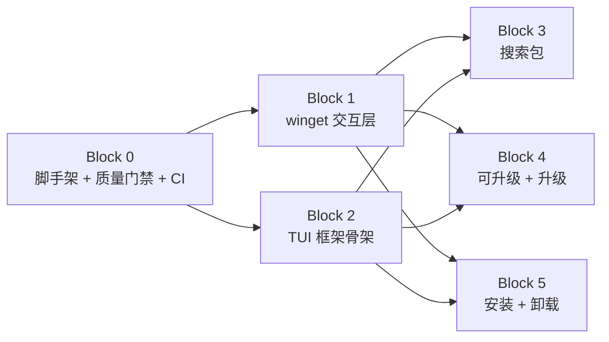
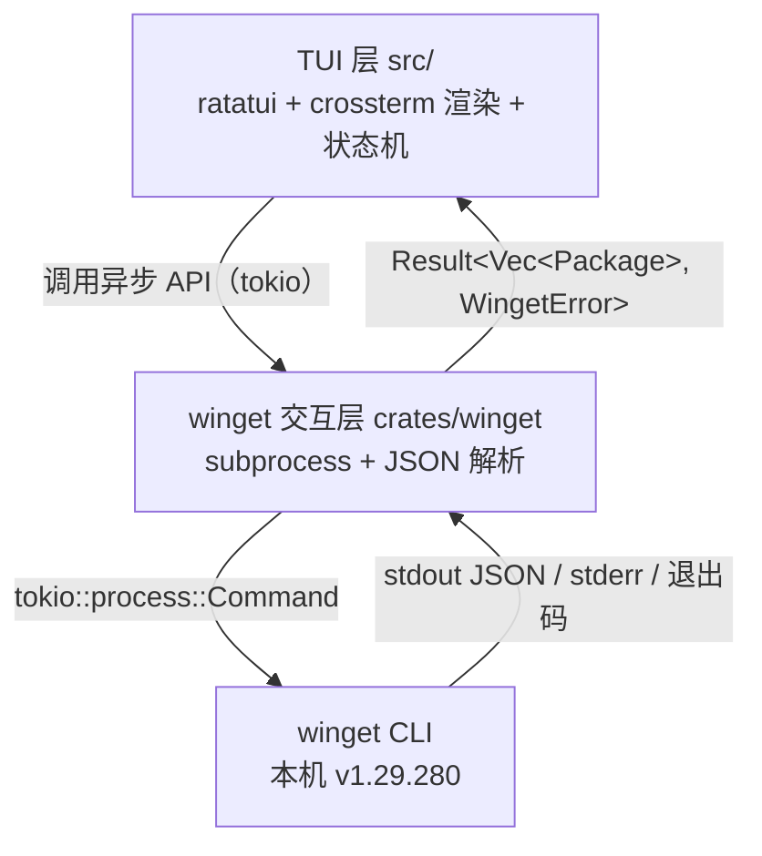
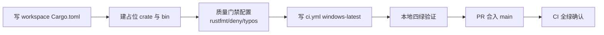
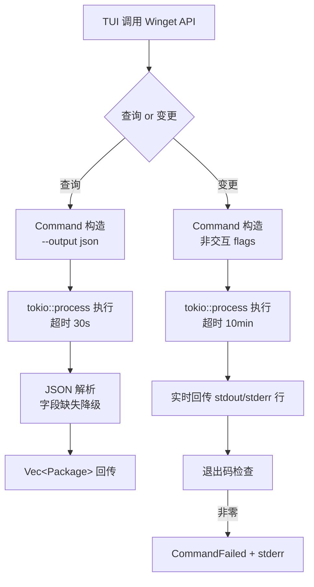
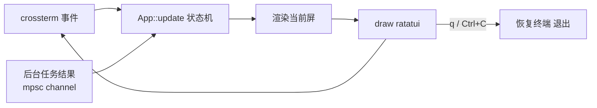
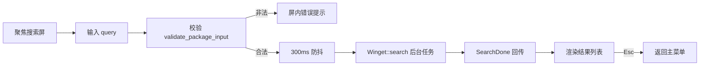
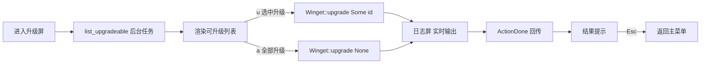
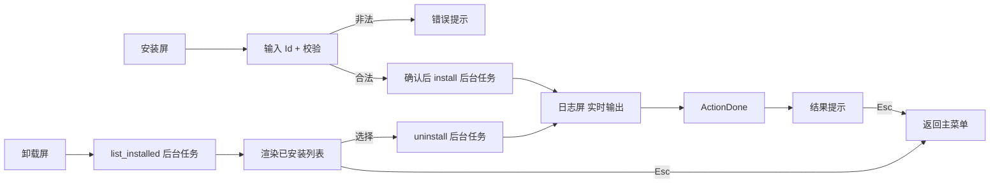

# MVP 规格 — wingetui

> 规格工程师：章定规 · 2026-08-14 · 状态：已定稿
> 上游输入：[`docs/context.md`](../docs/context.md) 与 [`.rules/`](../.rules/) 治理文档；本规格是 Phase 3 实现的唯一依据，工单编号见 [工单映射](#8-工单映射)。

## 1. 背景

wingetui 是一个管理 winget 的 TUI 工具（Rust + ratatui + crossterm + tokio，参考 gitui 架构）。Phase 1 已定稿需求上下文（[docs/context.md](../docs/context.md)）与 4 份 ADR（[0001](../docs/adr/0001-tokio-async.md) / [0002](../docs/adr/0002-winget-subprocess.md) / [0003](../docs/adr/0003-public-repo.md) / [0004](../docs/adr/0004-windows-only.md)）。本规格将 MVP 拆分为 6 个实现块，每块对应一张 GitHub 工单，供实现工程师按块交付。

## 2. 目标 / 非目标

### 目标
1. 交付可运行的 Cargo workspace 工程脚手架，质量门禁四绿（fmt / clippy / test / check-links），GitHub Actions CI 在 `windows-latest` 全绿。
2. 交付 winget CLI 交互层独立 crate（`crates/winget`），查询类 JSON 解析、变更类非交互执行。
3. 交付核心 TUI 五流程：搜索包、查看可升级、升级、安装、卸载。

### 非目标（MVP 明确不做）
- 包详情页、批量多选、可配置键位/主题
- `winget configure` / `import` / `export`
- 非 Windows 平台（[ADR-0004](../docs/adr/0004-windows-only.md)）
- 客户端侧模糊匹配（`fuzzy-matcher`）：MVP 搜索依赖 winget 服务端匹配，`fuzzy-matcher` 延后评估，不在 MVP 引入

## 3. 范围

交付物 = 6 个实现块（Block 0–5），依赖关系如下：



- Block 0 无依赖，先行；Block 1、Block 2 依赖 Block 0，可并行；Block 3/4/5 依赖 Block 1 + Block 2，可并行。
- 每块独立可交付、独立验收、独立 PR 合入 `main`。

## 4. 全局架构与接口契约

### 4.1 架构分层



- TUI 层只依赖 `crates/winget` 公开 API，不触碰 subprocess / JSON / winget 细节。
- 所有 winget 调用经 `tokio::process::Command` 异步执行，结果经 channel 回传 UI，UI 不阻塞（[ADR-0001](../docs/adr/0001-tokio-async.md)）。

### 4.2 crates/winget 公开 API（接口契约）

```rust
// crates/winget/src/lib.rs
pub struct Package {
    pub id: String,                 // winget Id，如 "Microsoft.PowerShell"
    pub name: String,
    pub version: String,            // 当前/已装版本；搜索时为匹配版本
    pub available_version: Option<String>, // 仅升级列表有值
    pub source: Option<String>,
}

pub enum WingetError {
    Validation(String),             // 输入校验失败（空/控制字符/超长）
    NotFound,                       // 无匹配包（winget 未找到）
    Timeout,                        // 查询 30s / 变更 10min 超时
    Io(String),
    Parse(String),                  // JSON 解析失败（字段缺失降级，整体失败才报）
    CommandFailed { code: i32, stderr: String },
}

pub struct Winget { /* 无状态门面 */ }

impl Winget {
    pub fn new() -> Self;
    pub async fn search(&self, query: &str) -> Result<Vec<Package>, WingetError>;
    pub async fn list_upgradeable(&self) -> Result<Vec<Package>, WingetError>;
    pub async fn list_installed(&self) -> Result<Vec<Package>, WingetError>;
    pub async fn upgrade(&self, id: Option<&str>) -> Result<(), WingetError>; // None => 升级全部
    pub async fn install(&self, id: &str) -> Result<(), WingetError>;
    pub async fn uninstall(&self, id: &str) -> Result<(), WingetError>;
}

// 输入校验（TUI 层与 winget 层共用同一规则）
pub fn validate_package_input(s: &str) -> Result<(), WingetError>;
```

### 4.3 winget 命令契约（Block 1 内部实现约束）

| 类别 | 命令 | 附加参数 |
|------|------|----------|
| 查询 | `winget search --query <q>` | `--output json --disable-interactivity --accept-source-agreements` |
| 查询 | `winget upgrade`（列可升级） | `--output json --disable-interactivity --accept-source-agreements` |
| 查询 | `winget list`（列已安装） | `--output json --disable-interactivity --accept-source-agreements` |
| 变更 | `winget upgrade --id <id>` | `--silent --accept-package-agreements --accept-source-agreements --disable-interactivity` |
| 变更 | `winget upgrade --all` | 同上 |
| 变更 | `winget install --id <id>` | 同上 |
| 变更 | `winget uninstall --id <id>` | 同上 |

- 参数一律经 `Command::arg()` 数组传入，**禁止 shell 拼接**（[安全规范](../.rules/security.md)）。
- 超时：查询类 30s，变更类 10min（可配置常量）。
- 退出码：非零 → `CommandFailed`（附 stderr）；winget "无匹配包" 场景映射为 `NotFound`。
- 变更类实时回传 stdout/stderr 行到 UI 日志区（`BackgroundEvent::LogLine`）。

### 4.4 TUI 层接口契约

```rust
// src/state/mod.rs
pub enum AppState {
    MainMenu,
    Search(SearchState),
    Upgrade(UpgradeState),
    Install(InstallState),
    Uninstall(UninstallState),
    Log(LogState),          // 变更操作实时输出
}

// 后台任务回传事件
pub enum BackgroundEvent {
    SearchDone(Result<Vec<Package>, WingetError>),
    UpgradeListDone(Result<Vec<Package>, WingetError>),
    InstalledListDone(Result<Vec<Package>, WingetError>),
    ActionDone(Result<(), WingetError>),
    LogLine(String),        // 变更命令实时 stdout/stderr
}
```

- 事件循环：crossterm 事件（Key / Resize）驱动状态机；后台任务经 `tokio::sync::mpsc::UnboundedSender<BackgroundEvent>` 回传。
- 每个合法按键事件至少一个状态迁移测试（[测试规范](../.rules/testing.md)）。

## 5. 验收标准（全局）

1. `cargo fmt --check`、`cargo clippy -- -D warnings`、`cargo test`、`python scripts/check-links.py` 四绿（本地与 CI 一致）。
2. CI（`.github/workflows/ci.yml`）在 `windows-latest` 上 push 全绿。
3. 公开仓库无隐私泄漏：fixture 一律脱敏，禁本机真实软件列表（[安全规范](../.rules/security.md)、[ADR-0003](../docs/adr/0003-public-repo.md)）。
4. 任何编辑过的 Markdown 必须过 `check-links.py`（exit 0）。
5. 所有 winget 命令无 shell 拼接（代码评审 + 命令构造单测断言 argv）。

## 6. 风险

| 风险 | 说明 | 缓解 |
|------|------|------|
| winget JSON 格式随版本演进 | 本机 v1.29.280 的 `--output json` 字段可能变化 | 解析层字段缺失降级；fixture 覆盖正常/畸形/缺失；CI 用 mock winget 不依赖真实 winget |
| 首次运行 winget 源协议弹窗 | 查询/变更可能触发 source agreement 交互 | 查询类追加 `--accept-source-agreements --disable-interactivity` |
| CI 无法访问真实 winget 行为 | runner 上有 winget 但行为不可控 | 单测/集成全走 mock winget 二进制；CI 不调用真实 winget |
| TUI 渲染与状态机解耦不足 | 状态机测试困难 | 状态机纯逻辑无渲染依赖，事件驱动可单测 |
| 变更类命令无进度反馈 | 安装/卸载耗时可能较长 | 实时回传 stdout/stderr 行到日志区 |

## 7. 实现块规格

> 每块独立成节：目标 / 范围 / 输入输出 / 验收标准 / 依赖 / 涉及文件 / 流程图。

### Block 0 — 工程脚手架 + 质量门禁 + CI

#### 目标
搭建可编译的 Cargo workspace（含 `crates/winget` 空 crate 与 TUI 二进制占位），配置四绿质量门禁与 GitHub Actions CI，补齐 README。

#### 范围
- workspace 根 `Cargo.toml`：members = `[".", "crates/winget"]`；TUI 二进制 `src/main.rs` + `src/lib.rs` 占位。
- `rustfmt.toml`、`deny.toml`（cargo-deny）、`typos.toml`（typos）。
- `.github/workflows/ci.yml`：`windows-latest`，job 依次跑 fmt → clippy → test → check-links → deny → typos；actions 固定 commit SHA。
- `README.md`：项目定位、构建/运行说明。

#### 输入 / 输出
- 输入：无（空仓库起步）。
- 输出：可 `cargo build` 的 workspace；CI 配置；质量门禁配置文件。

#### 验收标准（可测试）
1. `cargo build` 成功（workspace 全量，Windows）。
2. `cargo fmt --check` exit 0。
3. `cargo clippy -- -D warnings` exit 0。
4. `cargo test` exit 0（占位测试通过）。
5. `python scripts/check-links.py` exit 0。
6. push 后 CI 在 `windows-latest` 全绿（`gh run list` 可查）。
7. README 包含构建与运行命令。

#### 依赖
无（先行块）。

#### 涉及文件
`Cargo.toml`、`rustfmt.toml`、`deny.toml`、`typos.toml`、`src/main.rs`、`src/lib.rs`、`crates/winget/Cargo.toml`、`crates/winget/src/lib.rs`（占位）、`.github/workflows/ci.yml`、`README.md`

#### 流程图



### Block 1 — winget 交互层（crates/winget）

#### 目标
实现 `crates/winget` 全部公开 API：数据模型、JSON 解析、命令构造（无 shell）、输入校验、mock winget 测试。

#### 范围
- `models.rs`：`Package`。
- `parser.rs`：解析 `winget search/upgrade/list --output json` 输出；字段缺失降级，整体失败返回 `Parse`。
- `commands.rs`：命令构造（`Command::arg` 数组）；查询/变更两套参数模板；超时常量。
- `validate.rs`：`validate_package_input`（拒空串/控制字符/`>200` 字符）。
- `lib.rs`：`Winget` 门面 + `WingetError`。
- 测试：`crates/winget/tests/fixtures/*.json`（脱敏）+ `tests/mock-winget/`（mock winget 二进制）。

#### 输入 / 输出
- 输入：查询词 / 包 Id（由 TUI 层传入）。
- 输出：`Result<Vec<Package>, WingetError>` / `Result<(), WingetError>`。

#### 验收标准（可测试）
1. 解析单测覆盖：正常 JSON → 正确字段映射；畸形 JSON → `Parse`；字段缺失 → 降级默认值；空结果 → 空 vec。
2. 命令构造单测：`search/upgrade/list/install/uninstall` 的 argv 与 [4.3](#43-winget-命令契约block-1-内部实现约束) 完全一致；断言无 shell 拼接。
3. 校验单测：空串/纯空白/控制字符/`>200` 字符 → `Validation`；正常 Id → Ok。
4. 集成测试：`Winget::search` 经 mock winget 返回 fixture 解析结果；退出码非零 → `CommandFailed` 含 stderr；mock 返回"无匹配" → `NotFound`。
5. 超时常量存在且取值正确（查询 30s、变更 10min）。
6. 全部 fixture 脱敏（评审确认无本机真实信息）。

#### 依赖
Block 0（workspace 存在）。

#### 涉及文件
`crates/winget/src/lib.rs`、`crates/winget/src/models.rs`、`crates/winget/src/parser.rs`、`crates/winget/src/commands.rs`、`crates/winget/src/validate.rs`、`crates/winget/tests/fixtures/*.json`、`tests/mock-winget/`

#### 流程图



### Block 2 — TUI 框架骨架（ratatui + crossterm + tokio）

#### 目标
搭建 TUI 主循环：crossterm 事件循环、`AppState` 状态机、渲染骨架（主菜单 + 5 个屏占位 + 日志区）、tokio 后台任务 channel。

#### 范围
- `event.rs`：crossterm 事件循环（Key / Resize），`tokio::select!` 合并后台事件。
- `state/mod.rs`：`AppState` 枚举 + `BackgroundEvent`。
- `ui/mod.rs`：各屏渲染函数（主菜单 / 搜索 / 升级 / 安装 / 卸载 / 日志）。
- 主菜单含 5 个入口：搜索包 / 查看可升级 / 安装包 / 卸载包 / 退出。

#### 输入 / 输出
- 输入：键盘事件。
- 输出：状态迁移 + 渲染帧；退出时恢复终端（leave alternate screen）。

#### 验收标准（可测试）
1. `cargo run` 启动显示主菜单，无 panic。
2. 状态机单测：每个合法按键事件至少一个迁移断言（如 `MainMenu → Search`、`q`/`Ctrl+C` → 退出）。
3. 事件循环对 Resize 不崩溃。
4. 退出路径恢复终端（测试可断言 `App::run` 返回后无残留 raw mode）。
5. 后台任务 channel 连通：注入 `BackgroundEvent` 能更新对应状态。

#### 依赖
Block 0（workspace 存在）；不依赖 Block 1 实现（可并行，仅依赖其 API 定义）。

#### 涉及文件
`src/main.rs`、`src/app.rs`、`src/event.rs`、`src/state/mod.rs`、`src/state/{search,upgrade,install,uninstall}.rs`（占位）、`src/ui/mod.rs`、`src/ui/{main_menu,search,upgrade,install,uninstall,log}.rs`（占位）

#### 流程图



### Block 3 — 搜索包

#### 目标
实现搜索屏：输入框（含校验）、防抖触发 `Winget::search`、结果列表展示、加载态、返回主菜单。

#### 范围
- `state/search.rs`：`SearchState { query, results, loading, error }`。
- `ui/search.rs`：输入框 + 结果列表 + 加载指示。
- 触发规则：输入变化后 300ms 防抖触发搜索（tokio time）；空输入不触发。

#### 输入 / 输出
- 输入：搜索词（键盘）。
- 输出：匹配包列表；`NotFound`/错误在屏内提示。

#### 验收标准（可测试）
1. 状态机单测：输入非空 → 触发搜索任务 → `SearchDone` → 列表态；空输入不触发。
2. 校验：`>200` 字符 / 控制字符输入 → 屏内错误提示，不发起 subprocess。
3. 集成测试（mock winget）：输入 `powershell` → mock 收到 `search --query powershell --output json ...` → 结果渲染到列表。
4. `Esc`/`Back` 返回主菜单。
5. 加载态存在：搜索进行中显示 loading，期间再输入不重复触发（防抖）。

#### 依赖
Block 1（winget 层）、Block 2（TUI 框架）。

#### 涉及文件
`src/state/search.rs`、`src/ui/search.rs`、`src/app.rs`（挂接 Search 分支）、`crates/winget`（只调用公开 API）

#### 流程图



### Block 4 — 查看可升级 + 升级

#### 目标
实现升级屏：进入时 `Winget::list_upgradeable` 加载可升级列表；支持升级选中项 / 升级全部；变更期间日志区实时输出。

#### 范围
- `state/upgrade.rs`：`UpgradeState { items, selected, loading, action: Option<Action> }`。
- `ui/upgrade.rs`：列表 + 操作提示（`u` 升级选中 / `a` 升级全部）。
- 变更命令执行期间切到日志屏（`LogState`），实时显示 stdout/stderr。

#### 输入 / 输出
- 输入：键盘（选择 / 升级 / 返回）。
- 输出：升级结果；成功/失败提示；日志回放。

#### 验收标准（可测试）
1. 进入升级屏自动加载：mock 返回可升级 fixture → 列表渲染；加载失败 → 错误提示可重试。
2. 升级选中：mock 收到 `upgrade --id <id>` + 非交互 flags（argv 断言）。
3. 升级全部：mock 收到 `upgrade --all` + 非交互 flags。
4. 变更期间日志区逐行追加 mock 输出的 stdout/stderr；结束后回结果态。
5. `Esc` 返回主菜单；升级中禁止再次触发（防重复提交）。

#### 依赖
Block 1、Block 2；复用 Block 3 的列表/校验模式（不强制依赖其代码）。

#### 涉及文件
`src/state/upgrade.rs`、`src/ui/upgrade.rs`、`src/state/log.rs`、`src/ui/log.rs`、`src/app.rs`

#### 流程图



### Block 5 — 安装 + 卸载

#### 目标
实现安装屏与卸载屏：安装输入包 Id（校验 + 确认）后执行；卸载列出已安装包并选择执行；变更期间日志区实时输出。

#### 范围
- `state/install.rs`：`InstallState { input, status }`。
- `state/uninstall.rs`：`UninstallState { items, selected, loading, action }`。
- `ui/install.rs`、`ui/uninstall.rs`：输入/列表 + 日志区复用。

#### 输入 / 输出
- 输入：安装包 Id / 卸载选中项。
- 输出：变更结果；日志回放。

#### 验收标准（可测试）
1. 安装：输入合法 Id → 确认 → mock 收到 `install --id <id>` + 非交互 flags；非法输入 → 屏内错误且不发起 subprocess。
2. 卸载：进入卸载屏 → `list_installed` 后台任务 → 列表渲染；选中 → mock 收到 `uninstall --id <id>` + 非交互 flags。
3. 变更期间日志区逐行输出；结束后回结果态；`Esc` 返回。
4. 校验规则与搜索一致（复用 `validate_package_input`）。

#### 依赖
Block 1、Block 2；复用 Block 4 的日志/变更模式。

#### 涉及文件
`src/state/install.rs`、`src/state/uninstall.rs`、`src/ui/install.rs`、`src/ui/uninstall.rs`、`src/state/log.rs`、`src/ui/log.rs`、`src/app.rs`

#### 流程图



## 8. 工单映射

| Block | 工单 | 标题（Conventional Commits） |
|-------|------|------------------------------|
| Block 0 | #1 | `chore(workspace): 搭建 Cargo workspace 脚手架与质量门禁` |
| Block 1 | #2 | `feat(winget): winget CLI 交互层（subprocess + JSON 解析）` |
| Block 2 | #3 | `feat(tui): ratatui/crossterm/tokio TUI 框架骨架与状态机` |
| Block 3 | #4 | `feat(search): 搜索包流程` |
| Block 4 | #5 | `feat(upgrade): 查看可升级与升级流程` |
| Block 5 | #6 | `feat(install): 安装与卸载流程` |
